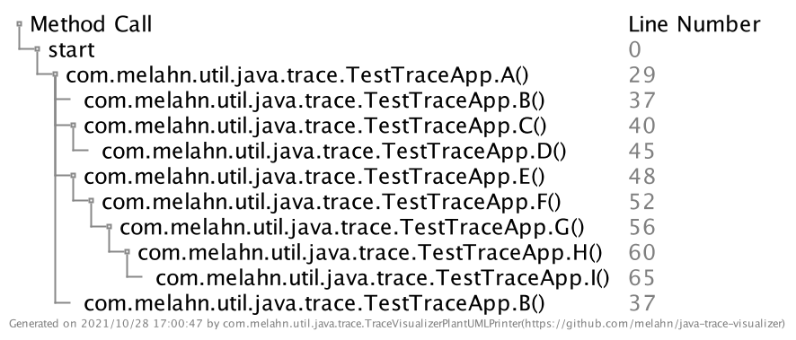

# java-trace-visualizer

[](https://github.com/melahn/java-trace-visualizer/actions/workflows/build.yml)
[](https://sonarcloud.io/dashboard?id=melahn_java-trace-visualizer)

## Overview

A  project to make jdb trace output easier to understand.

## Prerequisites

Java 8 or later.  

## Goals

* Make a single threaded jdb trace output easier to understand
* Allow the user to visualize the trace in different ways including as a simple ascii text tree view and as a PlantUML tree view
* Generate some simple statistics derived from information in the trace

## Description and Architecture

This project grew out of my need to better understand the flow of some source code I had written several years ago, as I was trying to optimize the code.  While the [Java Debugger](https://docs.oracle.com/javase/8/docs/technotes/tools/windows/jdb.html) generates a lot of information about the code flow, it was not easy for me to see the overall 'shape' of the flow so I could spot areas for improvement. I created this project to help me.  

The project introduces a *TraceVisualizer* class whose job it is to collect the command line parameters and then enlist a *TraceVisualizerPrinter* to accomplish the goal of producing the visualization and statistics files. The *TraceVisualizerPrinter* is an interface that has several implementations. *TraceVisualizerBasePrinter* is an abstract class that handles the details of parsing the jdb trace file and reducing it to a *LinkedHashMap* and gathering simple statistics.

The actual printing is done by two subclasses *TraceVisualizerTextPrinter* and *TraceVisualizerPlantUMLPrinter*. *TraceVisualizerTextPrinter* generates an easy-to-read ascii text tree view showing method invocations and line numbers for the methods called. *TraceVisualizerPlantUMLPrinter* provides a similar view, except it uses PlantUML as an intermediate form, from which an image is generated. For more information about PlantUML, see [PlantUML](http://plantuml.com/).

The generated statistics include just the method name and the number of times the method was called, as a csv file.

All the classes are packaged in a shaded jar that contains all the dependencies needed. The jar is a snapshot version for now. Before I publish the artifact to a central repository, I will create Version 1.0.0.

At the moment, the generated visualization does not take into account multiple Java threads, though that information is present in the jdb trace file. The project includes some stub code that will be expanded in a future version to at least allow the user to select which thread is of interest. Also, in a future version, I will add support for dynamic tree views using JavaScript.

The code has complete test coverage as measured by [Sonar Cloud](https://sonarcloud.io/dashboard?id=melahn_java-trace-visualizer). Continuous integration (CI) is provided by a [GitHub Build Action](https://github.com/melahn/java-trace-visualizer/actions/workflows/build.yml).

## Usage

### Command Line Syntax

``` java
java -jar java-trace-visualizer-1.0.0-SNAPSHOT.jar

Flags:
  -i  <filename>  The name of the input trace file 
  -o  <filename>  The name of the output trace visualization file
  -s  <filename>  The name of the output stats file
  -g              Generate image from the PlantUML file
  -h              Help               
```

#### Flags

* **Required**
  * **-i** \<filename\>
    * The name of the input file. This is the output of the jdb command captured in a file.
  * **-o** \<filename\>
    * The name of the output trace visualization file to be created. If the name has the extension 'puml', the file will be written in *PlantUML* format. Otherwse it will be written as a text file.
* **Optional**
  * **-s** \<filename\>
    * The name of the output file to be created to hold generated statistics. This is a csv file.
  * **-g**
    * Generate image. Whenever specified, an image file is generated from the PlantUML file.  This is only applicable if
      the filename of the generated output trace visualization file has the extension 'puml'. The name given the image file is the name of the output trace visualization file except it will have the extension 'png'.
  * **-h**
    * Help. Whenever specified, any other parameters are ignored.  When no parameters are specified, **-h** is assumed.

### Examples

#### Example Commands

##### Generating a Trace Visualization as an Ascii Text File

``` java
java -jar java-trace-visualizer-1.0.0-SNAPSHOT.jar -i foo.jdb.out -o foo.txt 
```

##### Generating a Trace Visualization as a PlantUML File with an Accompanying Image File

``` java
java -jar java-trace-visualizer-1.0.0-SNAPSHOT.jar -i foo.jdb.out -o foo.puml -g 
```

#### Example Output

The following example visualizations were generated from [a simple jdb trace](https://github.com/melahn/java-trace-visualizer/blob/main/resource/example/example-single-thread-trace-file.jdb.out.txt).  This jdb file was produced by cloning this repo and then running the following commands in the directory where it was cloned.

``` bash
cd java-trace-visualizer/target/test-classes 
export CLASSPATH=.
jdb com.melahn.util.java.trace.TestTraceApp > example-single-thread-trace-file.jdb.out.txt 
```

... and then entering the following jdb commands.  Note that you cannot see the jdb cursor or the jdb output since it is being redirected, so cutting and pasing the commands is a good approach.

``` jdb
stop in com.melahn.util.java.trace.TestTraceApp.main
run
exclude java.*, jdk.*, sun.*, javax.*, com.sun.*
trace go methods
cont
```

Note that the purpose of the *exclude* command is to filter out the noise of the JVM and utility classes.

##### Example Text File Output

``` text
 thread: main 
     
       start 
         |
         |____ com.melahn.util.java.trace.TestApp.A() (line 13) 
         |    |
         |    |____ com.melahn.util.java.trace.TestApp.B() (line 18) 
         |
         |____ com.melahn.util.java.trace.TestApp.C() (line 21) 
         |    |
         |    |____ com.melahn.util.java.trace.TestApp.D() (line 26) 
         |
         |____ com.melahn.util.java.trace.TestApp.E() (line 29) 
         |    |
         |    |____ com.melahn.util.java.trace.TestApp.F() (line 34) 
         |         |
         |         |____ com.melahn.util.java.trace.TestApp.G() (line 38) 
         |              |
         |              |____ com.melahn.util.java.trace.TestApp.H() (line 43) 
         |
         |____ com.melahn.util.java.trace.TestApp.I() (line 47) 
         |
         |____ com.melahn.util.java.trace.TestApp.B() (line 18) 

Generated on 2021/10/25 16:23:57 by com.melahn.util.java.trace.TraceVisualizerTextPrinter (https://github.com/melahn/java-trace-visualizer)
```

##### Example Image Output



##### Example PlantUML File Output

``` text
@startuml Java Trace
scale 2
skinparam FooterFontColor Gray
skinparam FooterFontSize 6
salt
{
    {T
         Method Call |  Line Number
        +start | <color:Gray>0
        ++ com.melahn.util.java.trace.TestTraceApp.A() | <color:Gray>29
        +++ com.melahn.util.java.trace.TestTraceApp.B() | <color:Gray>37
        +++ com.melahn.util.java.trace.TestTraceApp.C() | <color:Gray>40
        ++++ com.melahn.util.java.trace.TestTraceApp.D() | <color:Gray>45
        +++ com.melahn.util.java.trace.TestTraceApp.E() | <color:Gray>48
        ++++ com.melahn.util.java.trace.TestTraceApp.F() | <color:Gray>52
        +++++ com.melahn.util.java.trace.TestTraceApp.G() | <color:Gray>56
        ++++++ com.melahn.util.java.trace.TestTraceApp.H() | <color:Gray>60
        +++++++ com.melahn.util.java.trace.TestTraceApp.I() | <color:Gray>65
        +++ com.melahn.util.java.trace.TestTraceApp.B() | <color:Gray>37
    }
}
center footer Generated on 2021/10/28 15:20:29 by com.melahn.util.java.trace.TraceVisualizerPlantUMLPrinter(https://github.com/melahn/java-trace-visualizer)
@enduml
```
